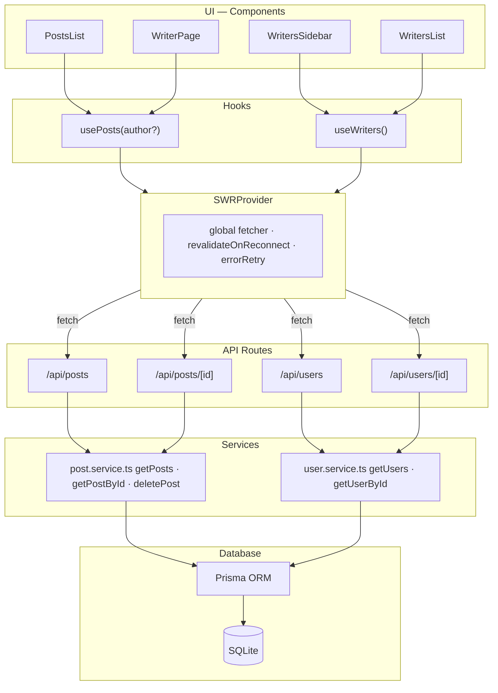

# Streapost
Streapost is a simple posts list explorer built with **Next.js**, **Prisma**, and **SQLite**.

**[Live demo](https://streapost.vercel.app/)**

The application lists posts and allows filtering them by the author (`userId`). It also supports deleting posts and includes error handling for network failures.

The project was built as part of a technical challenge.

---

# Tech Stack
- Next.js
- TypeScript
- Prisma ORM + SQLite
- Tailwind CSS
- SWR
- lucide-react
- next-theme

---

# Getting Started

## Requirements

- Node.js >= 20.19
- npm >= 10

Recommended:

- Node 22 LTS

## 1. Install dependencies
Ensure you are using Node.js >= 20.19.

If you use nvm:
```bash
nvm install 22
```
```bash
nvm use 22
```

Then install dependencies:
```bash
npm install
```

## 2. Configure environment variables

Create a .env file in the project root with the following:

DATABASE_URL="file:./dev.db"

For simplicity in this challenge, the .env file is committed to the repository.

## 3. Run database migrations

```bash
npx prisma migrate dev
```

```bash
npx prisma generate
```

This will create the SQLite database (dev.db) and apply the schema.

## 4. Seed the database

```bash
npx prisma db seed
```

The seed script fetches data from:

https://jsonplaceholder.typicode.com/users

https://jsonplaceholder.typicode.com/posts

and inserts it into the local SQLite database.

## 5. Run the development server
```bash
npm run dev
```

Open:

http://localhost:3000

## Testing

Backend tests use Vitest. They cover services and API routes with mocked dependencies.

```bash
npm test
```

Tests are located in:
- `lib/services/__tests__/` — post.service, user.service
- `app/api/posts/__tests__/` — GET /api/posts
- `app/api/posts/[id]/__tests__/` — GET, DELETE /api/posts/:id
- `app/api/users/__tests__/` — GET /api/users
- `app/api/users/[id]/__tests__/` — GET /api/users/:id

Requires Node 20.19+ and `npm install` to be run successfully.

## Architecture
### Component organization
Components are grouped by domain under app/components/
- common/ — shared UI: Header, DeleteModal, EmptyState, LoadingOverlay, OfflineBanner, SWRProvider, ThemeProvider
- posts/ — post-specific: PostsList, PostCard, PostCardMenu, PostsFilter, PostsGrid
- writers/ — writer-specific: WritersSidebar

### Type definitions
Centralized in app/types/
- post.ts → Post, PostsResponse
- user.ts → User, Writer, WritersResponse
- index.ts → public re-exports

### Service layer
Prisma queries are isolated in lib/services/:
- post.service.ts → getPosts, getPostById, deletePost
- user.service.ts → getUsers, getUserById
- API routes only handle HTTP concerns (parsing, status codes, i18n errors)

### Custom hooks
Data fetching logic lives in app/hooks/:
- usePosts(options?) — SWR infinite scroll + debounced filter + optimistic delete. Accepts optional author for fixed external filter (writer profile page)
- useWriters() — SWR infinite scroll + debounced search
- useLanguage() — global i18n state via useSyncExternalStore
- useTheme() — dark/light mode
- useOnlineStatus() — connectivity detection via navigator.onLine + browser events

### Offline support
SWRProvider wraps the app with global SWR config (revalidateOnReconnect: true). OfflineBanner shows an offline indicator and a "back online" toast on reconnection.

## Project structure


# Features
- Browse posts with infinite scroll
- Filter posts by author name, username, email or ID
- View writer profiles with their full post history
- Search writers by name
- Delete posts with confirmation modal
- Offline banner when connection is lost, auto-revalidates on reconnect
- Dark / light mode toggle
- English and Spanish support
- Error handling for API failures

# Database

The application uses SQLite for simplicity.

## Tables
User
- id
- name
- username
- email
- phone
- website
- company
- city

Post
- id
- userId
- title
- body

## Relationship
User (1) → (N) Post

# Future Improvements
If this were a production project, possible improvements include:
- **Features:** Authentication/authorization, page to create and edit posts, comments on posts, image uploads (avatars, post images), full-text search, admin dashboard, data export
- **Security:** Rate limiting on API endpoints, input validation (e.g., Zod), CORS/CSP configuration
- **Infrastructure:** Redis caching, Docker deployment, CI/CD pipeline
- **Quality & observability:** E2E tests (e.g., Playwright), monitoring and error tracking (Sentry), API documentation (OpenAPI/Swagger)
- **UX:** PWA/offline support, SEO (metadata, sitemap), accessibility audit, push or email notifications
- **i18n:** Additional languages, automatic locale detection from browser